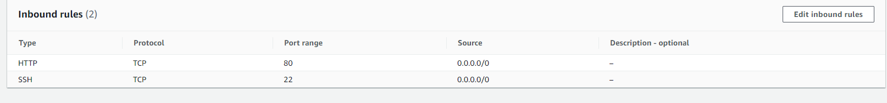
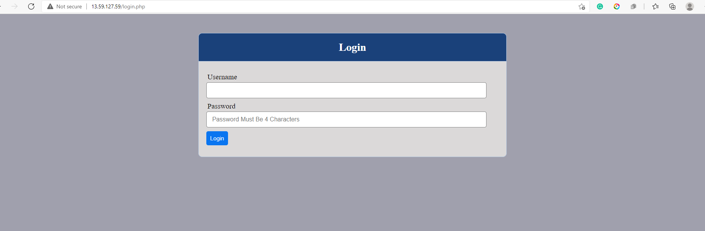
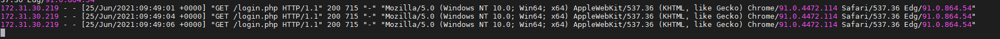

# Load Balancer Solution with Apache
### Create Load Balancer instance on EC2 and open web port

### Install Apache Load Balancer on Project-8-apache-lb server and configure it to point traffic coming to LB to both Web Servers:
```
sudo apt update
sudo apt install apache2 -y
sudo apt-get install libxml2-dev
sudo a2enmod rewrite
sudo a2enmod proxy
sudo a2enmod proxy_balancer
sudo a2enmod proxy_http
sudo a2enmod headers
sudo a2enmod lbmethod_bytraffic
```

### Configure load balancing
```
sudo vi /etc/apache2/sites-available/000-default.conf

#Add this configuration into this section <VirtualHost *:80>  </VirtualHost>

<Proxy "balancer://mycluster">
BalancerMember http://<WebServer1-Private-IP-Address>:80 loadfactor=5 timeout=1
BalancerMember http://<WebServer2-Private-IP-Address>:80 loadfactor=5 timeout=1
ProxySet lbmethod=bytraffic
# ProxySet lbmethod=byrequests
    </Proxy>

        ProxyPreserveHost On
        ProxyPass / balancer://mycluster/
        ProxyPassReverse / balancer://mycluster/

#Restart apache server

sudo systemctl restart apache2
```

### Go to LB Public IP/index.php to confirm


### Check if both webservers are receiving GET requests
> sudo tail -f /var/log/httpd/access_log
